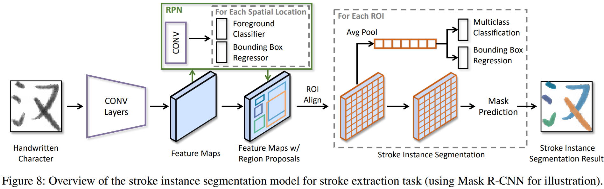
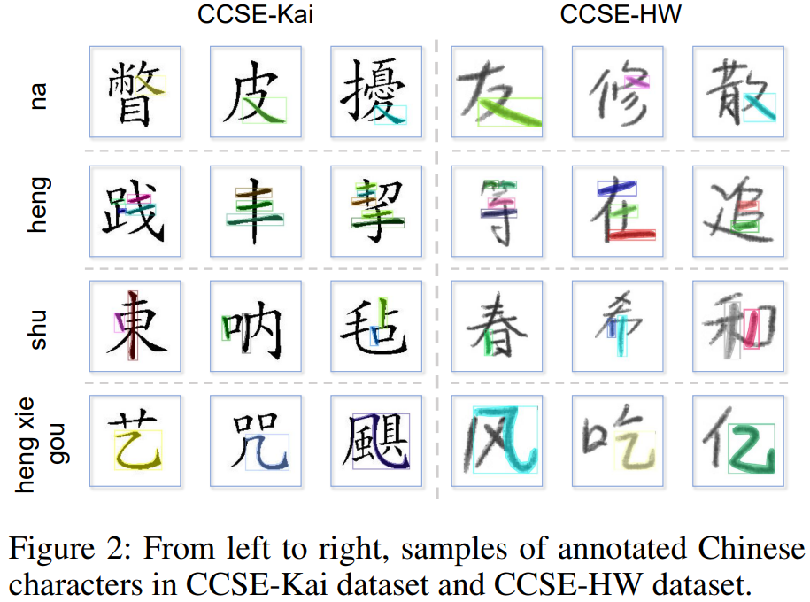
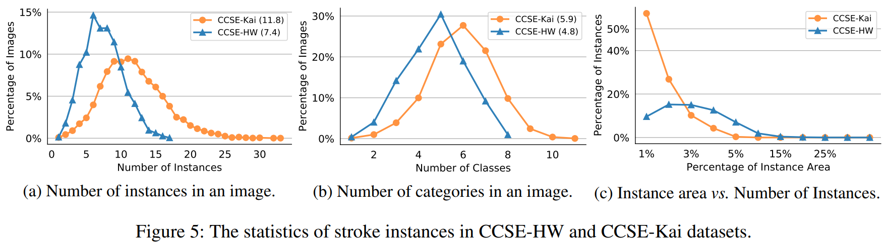
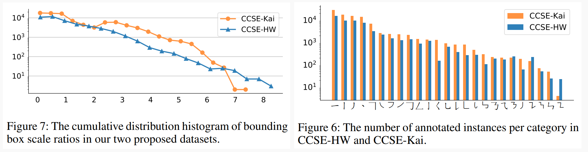
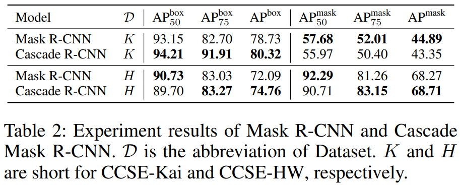
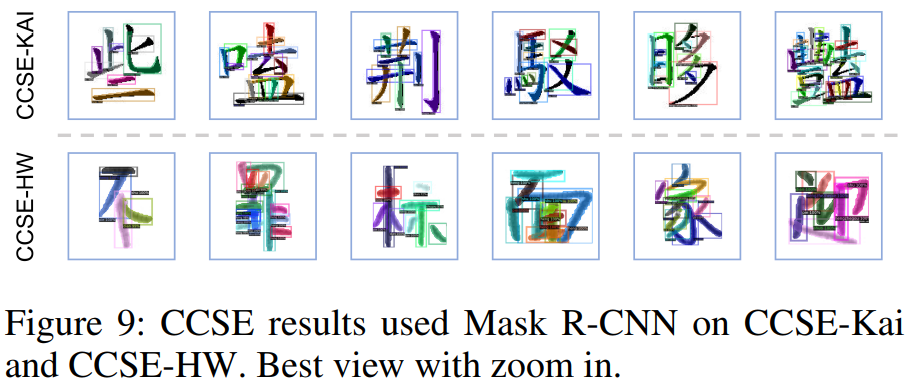

## Instance Segmentation for Chinese Character Stroke Extraction, Datasets and Benchmarks.

Created by 

Lizhao Liu, Kunyang Lin, Shangxin Huang from South China University of Technology; 

Qingyu Zhou, Zhongli Li from Tencent Cloud Xiaowei;

Chao Li from Xiaomi Group.

This repository contains the official PyTorch-implementation of our paper [*Instance Segmentation for Chinese Character Stroke Extraction,
Datasets and Benchmarks*](https://arxiv.org/pdf/2210.13826.pdf).

In particular, we release the code for reproducing the CNN-related results in the main paper.




*Suggestions are always welcome!*

---
## Datasets preparation.
- Download the datasets from Google Drive: 

  (1) [*Handwritten Chinese Character Stroke Extraction Dataset*](https://drive.google.com/file/d/1U8mLLb_qWSqC4yRnJlzoVaI2ELF2lGAH/view).
  
  (2) [*Kaiti Chinese Character Stroke Extraction Dataset*](https://drive.google.com/file/d/1-2VFuiWHSd3fzl9qYMoEi0mlO_BoSgCd/view)

- Direct download links are also available:
  
  (1) [*Handwritten Chinese Character Stroke Extraction Dataset*](https://drive.google.com/uc?export=download&id=1U8mLLb_qWSqC4yRnJlzoVaI2ELF2lGAH).
  
  (2) [*Kaiti Chinese Character Stroke Extraction Dataset*](https://drive.google.com/uc?export=download&id=1-2VFuiWHSd3fzl9qYMoEi0mlO_BoSgCd)

Note: Both datasets are annotated with the standard COCO format.

## Datasets visualization

<div align=center></div>

## Datasets Statistics

<div align=center></div>

<div align=center></div>

## How to use?
- Install required package
  - Install detectron2 pre-compiled version (require CUDA>=10.2, torch==1.7)
  ```bash
  python -m pip install detectron2 -f https://dl.fbaipublicfiles.com/detectron2/wheels/cu102/torch1.7/index.html
  ```
  - Install requirements.txt
  ```bash
  pip install -r requirements.txt
  ```

- Config related environments field for the used config files below
  - Set the ``DATA_ROOT`` to your datasets placing path
  - Set the ``GPU_IDS`` to your machine GPU IDs. Support multiple GPU, for example ``[0, 1]``. 
  - Set the ``OUTPUT_ID`` to your experiment name.
  - Set the ``OUTPUT_DIR``. The output files (checkpoint, log, tensorboard) are located at ``OUTPUT_DIR``/``OUTPUT_ID``/{timestamp}/

- Train a model
  - Template
  ```bash
  PYTHONPATH=$PYTHONPATH:./ python -u scripts/{your_train_script}.py --config {path_to_your_train_config}/{your_train_config}.yaml
  ```
  - To train a handwritten Chinese stroke instance segmentation model
  ```bash
  PYTHONPATH=$PYTHONPATH:./ python -u scripts/train_instance.py --config config/instance_segmentation/mask_rcnn_R_50_FPN_3x_handwritten.yaml
  ```
  - To train a kaiti Chinese stroke instance segmentation model
  ```bash
  PYTHONPATH=$PYTHONPATH:./ python -u scripts/train_instance.py --config config/instance_segmentation/mask_rcnn_R_50_FPN_3x_kaiti.yaml
  ```

- Inference (or test) a model
  - Set the ``MODEL.WEIGHTS`` to your trained ckpt path
  - Optional: Set ``IMAGE_PATHS`` for individual image results visualization
  - Optional: Set ``VIS_DATASET_RESULT`` for val/test results visualization
  - Template
  ```bash
  PYTHONPATH=$PYTHONPATH:./ python -u scripts/{your_inference_script}.py --config {path_to_your_inference_config}/{your_inference_config}.yaml
  ```
  - To inference a handwritten Chinese stroke instance segmentation model
  ```bash
  PYTHONPATH=$PYTHONPATH:./ python -u scripts/inference_instance.py --config config/instance_segmentation/mask_rcnn_R_50_FPN_3x_handwritten_test.yaml
  ```
  - To inference a kaiti Chinese stroke instance segmentation model
  ```bash
  PYTHONPATH=$PYTHONPATH:./ python -u scripts/inference_instance.py --config config/instance_segmentation/mask_rcnn_R_50_FPN_3x_kaiti_test.yaml
  ```
- Monitor the training process
```bash
cd ``OUTPUT_DIR`` # your output dir
tensorboard --logdir=./ --port=6006 --bind_all
```

- To reproduce the results in the paper
```bash
All commands are recorded in terminal_new.record file. Go check out.
```

## Project Structure
- `common` contains the utils functions that will be used across the whole projects
- `dataset` contains the dataloader used for training or inference for each task
- `initializer` contains the initializer (init env, log, output dir, etc.) for each task
- `module` contains the module will be used by some models or training/inference scripts
- `pre_process` contains the preprocessing code to preprocess the data
- `scripts` contains the entrance of training or inference a model

## How to add your new model to train (or inference)?
- Step 1: add the new model into `module` package
- Step 2: add the specific initializer into `initializer` package
- Step 3: add the training (or inference) into `scripts` package


## Quantitative Results

<div align=center></div>

## Qualitative Results

<div align=center></div>


## Acknowledgement
Our codebase is based on [detectron2](https://github.com/facebookresearch/detectron2). Please show some support!

## Citation
If you find this code helpful for your research, please consider citing
```
@article{liu2022instance,
  title={Instance Segmentation for Chinese Character Stroke Extraction, Datasets and Benchmarks},
  author={Liu, Lizhao and Lin, Kunyang and Huang, Shangxin and Li, Zhongli and Li, Chao and Cao, Yunbo and Zhou, Qingyu},
  journal={arXiv preprint arXiv:2210.13826},
  year={2022}
}
```